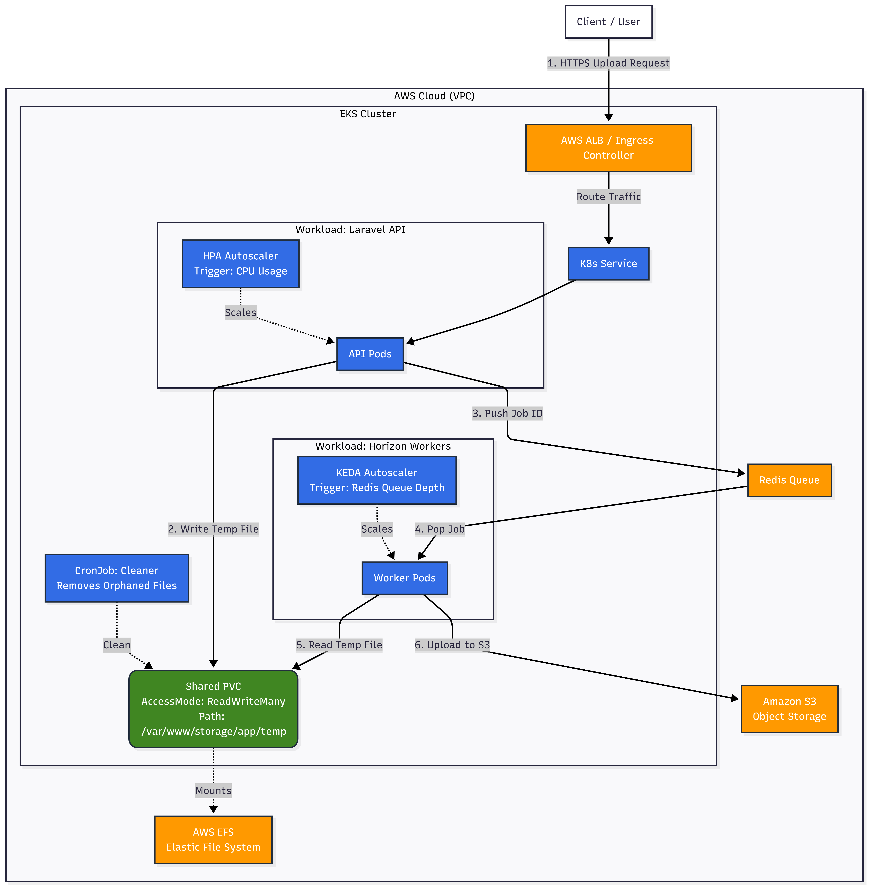

# Scalable K8s Upload Micro Service Architecture

This repository contains the infrastructure solution for a scalable K8s upload micro service  **Laravel** application to a cloud-native scalable **Kubernetes** architecture.

The design addresses two major bottlenecks **without requiring changes to application business logic**:

- **Resource contention** between API and background jobs  
- **Stateful local file storage** in a distributed container environment  

---

## Repository Structure & Manifest Breakdown

| File | Purpose |
| :--- | :--- |
| **`Dockerfile`** | Multi-stage build that installs system dependencies (Redis, BCMath), sets secure permissions, and runs the container as a non-root user (`www-data`). |
| **`k8s/laravel-config.yaml`** | Stores non-sensitive configuration (`APP_ENV`) in a ConfigMap. |
| **`k8s/laravel-api.yaml`** | Deploys the Laravel Web API with `replicas: 2`, liveness probes for self-healing, and strict CPU limits to prevent resource starvation. |
| **`k8s/laravel-worker.yaml`** | Deploys Laravel Horizon workers with `terminationGracePeriodSeconds: 60` and `preStop` hooks to ensure active jobs complete safely. |
| **`k8s/storage.yaml`** | Configures a **ReadWriteMany (RWX)** Persistent Volume backed by **AWS EFS** for shared file access across nodes. |
| **`k8s/autoscaling.yaml`** | Configures **HPA** for API autoscaling (CPU-based) and **KEDA** for worker autoscaling (Redis queue depth). |
| **`k8s/cleaner.yaml`** | Scheduled CronJob to remove orphaned temporary files from shared storage in case of worker crashes. |

---

## 1. Architectural Overview

### Key Design Decisions

#### 1. Workload Separation
- **API Tier**
  - Handles HTTP traffic only
  - Scales using **Horizontal Pod Autoscaler (HPA)**
- **Worker Tier**
  - Handles background file processing (Laravel Horizon)
  - Scales using **KEDA** based on Redis queue depth

This separation prevents background jobs from starving API resources.

---

#### 2. State Management (Shared Disk Strategy)

Because the legacy application relies on local temporary files:

- A **ReadWriteMany (RWX) Persistent Volume** backed by **AWS EFS** is used
- API pods write temporary files
- Worker pods (on any node) can immediately read and process them

This preserves legacy behavior while enabling horizontal scaling.

---

#### 3. Data Integrity & Safety

- `terminationGracePeriodSeconds` ensures workers are not killed mid-job
- `preStop` hooks allow Horizon to finish processing active jobs
- A **Cleaner CronJob** removes orphaned files left behind after crashes

---

## 2. Infrastructure Components

| Component | Technology | Purpose |
| :--- | :--- | :--- |
| **Compute** | Amazon EKS | Managed Kubernetes cluster |
| **Storage** | Amazon EFS | Shared RWX storage for temporary files |
| **Queue / Cache** | Redis | Job queues & caching |
| **Auto-scaling** | HPA + KEDA | Resource-based + event-driven scaling |

---

## 3. CI/CD Pipeline Strategy

The repository includes `.github/workflows/deploy.yaml` demonstrating the deployment automation approach.

---

### Continuous Integration (CI)

- **Automated Builds** triggered on every push
- **Immutable Artifacts**
  - Docker images are tagged with the **Git Commit SHA**
  - Example: `image:v1-a1b2c`
  - Prevents ambiguity caused by `latest` tags

---

### Continuous Delivery (CD) Using Kubernetes Manifests

All production deployments are performed using declarative Kubernetes manifests applied via **kubectl apply**.

This approach ensures transparency, predictability, and fine-grained control over infrastructure changes without relying on Helm templating.

**Deployment Characteristics**

- Declarative deployments using Kubernetes YAML manifests
- Rolling updates handled natively by Kubernetes Deployments
- Immutable Docker images, versioned using Git commit SHA
- Manual production approval enforced via GitHub Environments

---

## 4. Manual Deployment Instructions

For testing or evaluation purposes, the application can be deployed directly using raw Kubernetes manifests.

### Apply Storage & Configuration Files

```bash
# Deploy Workloads
kubectl apply -f k8s/laravel-config.yaml
kubectl apply -f k8s/01-storage.yaml

kubectl apply -f k8s/laravel-api.yaml
kubectl apply -f k8s/laravel-worker.yaml

# Setup Autoscaling & Maintenance
kubectl apply -f k8s/autoscaling.yaml
kubectl apply -f k8s/cleaner.yaml
